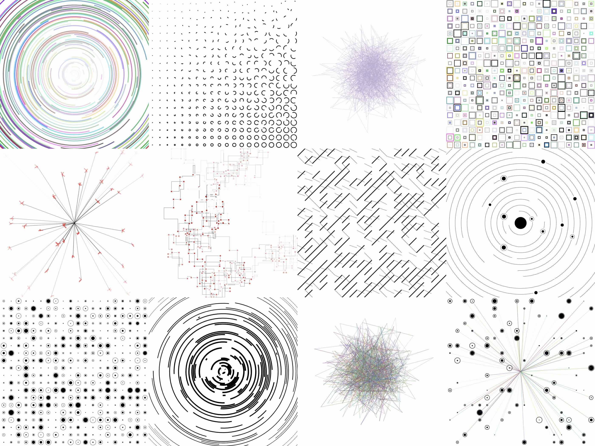

# Matisse 🖌

**Matisse** is a minimal gallery of generative art written with [Ink](https://github.com/thesephist/ink).

## Built entirely on Ink

Except for a couple of lines of JavaScript to bootstrap the app, Matisse is built on a stack entirely based on my [Ink programming language](https://github.com/thesephist/ink). Matisse's core [drawing functions](src/canvas.ink) and [generative algorithms](src/000.ink) are all written in Ink, and the Ink code is compiled down to JavaScript to run in the browser with [September](https://github.com/thesephist/september), an Ink-to-JavaScript compiler that's itself written in Ink. The whole project also uses the [inkfmt](https://github.com/thesephist/inkfmt) code formatter, which is an Ink program.

I think that's kind of cool 🙌

## Development and adding new pieces

Developing Matisse pieces is easiest if you have the following tools installed.

- GNU `make`
- An Ink interpreter, like [thesephist/ink](https://github.com/thesephist/ink)
- The [September compiler](https://github.com/thesephist/september)
- [entr](https://eradman.com/entrproject/), a utility to watch for changes to files and re-run commands
- [inkfmt](https://github.com/thesephist/inkfmt) for code formatting

Just running `make` in the project directory will compile the Ink program, save it to `static/js/bundle.js`, and print it out. While iterating on art pieces, it's convenient to re-compile the program on every change and immediately save it. `make watch` or `make w` do exactly this -- they'll re-run the compiler every time a change is made to the Ink code in `src/.

`make fmt` or `make f` will auto-format the Ink code in the repository.

Matisse is currently deployed with Vercel at [matisse.vercel.app](https://matisse.vercel.app).
